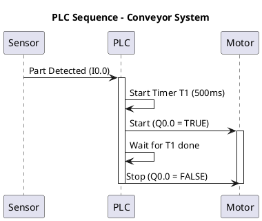
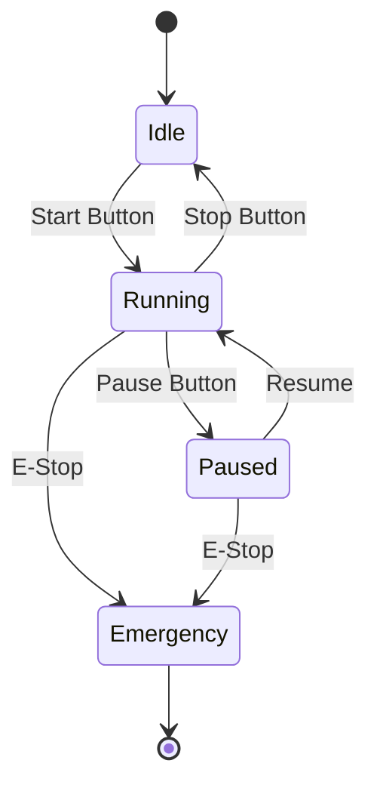
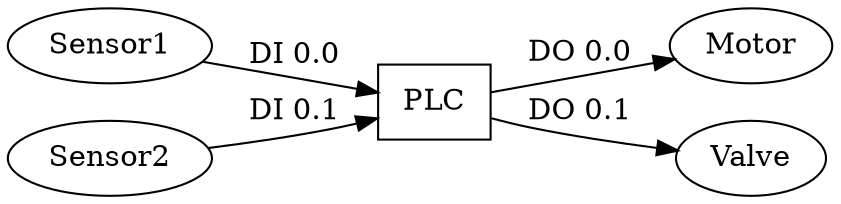

# Best Scripts and Tools for PLC Sequence & Single-Line Diagrams

## Overview

Creating clear, accurate diagrams is essential for PLC system documentation. This guide covers the best tools for generating sequence diagrams (timing charts, SFC) and single-line diagrams (electrical schematics).

## 1. Sequence Diagram Tools

### A. Official PLC Vendor Software

#### **Siemens TIA Portal**
- **Best for**: Siemens S7-1200/1500 PLCs
- **Features**: Native SFC (Sequential Function Chart) editor, integrated simulation
- **Export**: PDF, image formats
- **License**: Commercial (included with TIA Portal)
- **Pros**: Direct integration with PLC program, auto-sync with code
- **Cons**: Expensive, vendor lock-in

#### **Rockwell Studio 5000 / RSLogix**
- **Best for**: Allen-Bradley ControlLogix/CompactLogix
- **Features**: SFC editor, phase manager for batch processes
- **Export**: PDF, proprietary formats
- **License**: Commercial
- **Pros**: Industry standard for AB systems
- **Cons**: High cost, Windows-only

#### **CODESYS**
- **Best for**: IEC 61131-3 compliant PLCs (many brands)
- **Features**: Full SFC support, cross-platform
- **Export**: PDF, XML
- **License**: Free (basic), commercial (advanced)
- **Pros**: Vendor-neutral, widely supported
- **Cons**: Learning curve for advanced features

### B. Standalone Sequence Diagram Tools

#### **PlantUML** ⭐ Recommended for Open Source

- **Best for**: Version-controlled documentation, CI/CD integration
- **Features**: Text-based, generates PNG/SVG, supports timing diagrams
- **Installation**: `npm install -g plantuml` or use online editor
- **License**: Free, open source
- **Pros**: Git-friendly, scriptable, integrates with Markdown
- **Cons**: Limited to UML sequence diagrams, not true SFC

#### **Mermaid.js** ⭐ Recommended for Web Integration

- **Best for**: GitHub/GitLab wikis, web documentation
- **Features**: State diagrams, sequence diagrams, renders in browser
- **Installation**: Include JS library or use GitHub Markdown
- **License**: Free, open source (MIT)
- **Pros**: No installation needed, renders in many platforms
- **Cons**: Less control over layout than dedicated tools

#### **WaveDrom** ⭐ Best for Timing Diagrams
```json
{ "signal": [
  { "name": "clk", "wave": "p......" },
  { "name": "Input_Sensor", "wave": "0.1...0" },
  { "name": "PLC_Processing", "wave": "0..1.0." },
  { "name": "Output_Motor", "wave": "0...10." }
]}
```
- **Best for**: Digital timing diagrams, I/O state visualization
- **Features**: JSON-based, precise timing representation
- **Installation**: `npm install -g wavedrom-cli` or online editor
- **License**: Free, open source
- **Pros**: Perfect for showing signal timing relationships
- **Cons**: Not suitable for high-level process flow

### C. General Diagramming Tools with PLC Support

#### **draw.io (diagrams.net)** ⭐ Most Versatile
- **Best for**: Custom SFC, process flow, any diagram type
- **Features**: 
  - Pre-built SFC shapes library
  - Electrical symbols library
  - Export to PNG, SVG, PDF, XML
  - Desktop and web versions
- **Installation**: Free download or use https://app.diagrams.net
- **License**: Free, open source
- **Pros**: No learning curve, integrates with Google Drive/OneDrive
- **Cons**: Manual drawing (not code-generated)

#### **Lucidchart**
- **Best for**: Team collaboration
- **Features**: Real-time collaboration, templates, cloud storage
- **License**: Freemium (limited free tier)
- **Pros**: Professional appearance, easy sharing
- **Cons**: Subscription cost, requires internet

## 2. Single-Line Diagram Tools

### A. Electrical CAD Software

#### **AutoCAD Electrical** ⭐ Industry Standard
- **Best for**: Professional electrical design
- **Features**:
  - Automated wire numbering
  - PLC I/O assignment
  - Bill of materials generation
  - Standards-compliant symbols (IEC, NFPA)
- **License**: Commercial (expensive)
- **Pros**: Complete solution, widely accepted
- **Cons**: High cost, steep learning curve

#### **EPLAN Electric P8**
- **Best for**: Large-scale industrial projects
- **Features**: Macro library, automatic documentation, multi-language
- **License**: Commercial
- **Pros**: Powerful automation, excellent for panel design
- **Cons**: Very expensive, complex

#### **SolidWorks Electrical**
- **Best for**: Integration with 3D mechanical design
- **Features**: 2D schematics linked to 3D routing
- **License**: Commercial
- **Pros**: Unified mechanical/electrical design
- **Cons**: Requires SolidWorks ecosystem

### B. Open Source / Free Alternatives

#### **QElectroTech** ⭐ Best Free Option
- **Best for**: Small to medium projects, budget-conscious users
- **Features**:
  - Extensive symbol library (including PLCs)
  - Auto-numbering
  - Multi-page schematics
  - Cross-references
- **Installation**: Available for Windows, Linux, macOS
- **License**: Free, open source (GPL)
- **Pros**: No cost, active community, good symbol library
- **Cons**: Less polished than commercial tools
- **Download**: https://qelectrotech.org/

#### **KiCad** (with custom libraries)
- **Best for**: Users already familiar with PCB design
- **Features**: Schematic editor, custom symbol creation
- **License**: Free, open source
- **Pros**: Powerful, professional output
- **Cons**: Designed for PCBs, requires custom PLC symbol libraries

#### **LibreCAD** + Symbol Libraries
- **Best for**: Simple 2D drawings
- **Features**: Basic CAD, DXF/DWG support
- **License**: Free, open source
- **Pros**: Lightweight, easy to learn
- **Cons**: Manual symbol placement, no electrical intelligence

### C. Scripted/Programmatic Solutions

#### **Python + Schemdraw** ⭐ Best for Automation
```python
import schemdraw
import schemdraw.elements as elm

with schemdraw.Drawing() as d:
    d += elm.Line().right(2).label('L1')
    d += elm.Switch().label('Main Breaker')
    d += elm.Line().right(1)
    d += elm.Resistor().down().label('Motor\n5HP')
    d += elm.Line().left(3).label('L2')
    d.save('single_line.svg')
```
- **Best for**: Auto-generated documentation, CI/CD pipelines
- **Installation**: `pip install schemdraw`
- **License**: Free, open source (MIT)
- **Pros**: Version-controlled, reproducible, scriptable
- **Cons**: Requires Python knowledge, limited symbol library

#### **Graphviz** (for system architecture)

- **Best for**: System-level block diagrams
- **Installation**: `apt install graphviz` or `brew install graphviz`
- **License**: Free, open source
- **Pros**: Simple syntax, auto-layout
- **Cons**: Not for detailed electrical schematics

## 3. Recommended Workflow

### For Small Projects (Budget-Conscious)
1. **Sequence diagrams**: Mermaid.js (in Markdown docs)
2. **Single-line diagrams**: QElectroTech
3. **Documentation**: Markdown + PlantUML in Git repo

### For Medium Projects (Professional)
1. **Sequence diagrams**: draw.io with SFC templates
2. **Single-line diagrams**: QElectroTech or AutoCAD Electrical LT
3. **Documentation**: Confluence/SharePoint with embedded diagrams

### For Large Projects (Enterprise)
1. **Sequence diagrams**: Vendor PLC software (TIA Portal, Studio 5000)
2. **Single-line diagrams**: AutoCAD Electrical or EPLAN
3. **Documentation**: Integrated PLM system

### For Open Source / DevOps Teams
1. **Sequence diagrams**: PlantUML (text-based, in Git)
2. **Timing diagrams**: WaveDrom
3. **Single-line diagrams**: Python + Schemdraw (scripted)
4. **Documentation**: Sphinx or MkDocs with diagram plugins

## 4. Quick Comparison Table

| Tool | Type | Cost | Best For | Learning Curve |
|------|------|------|----------|----------------|
| PlantUML | Sequence | Free | Version control | Low |
| Mermaid | Sequence | Free | Web docs | Very Low |
| WaveDrom | Timing | Free | Signal timing | Low |
| draw.io | Both | Free | General use | Very Low |
| QElectroTech | Single-line | Free | Electrical schematics | Medium |
| AutoCAD Electrical | Single-line | $$$$ | Professional projects | High |
| TIA Portal | Sequence (SFC) | $$$ | Siemens PLCs | Medium |
| Schemdraw | Single-line | Free | Scripted diagrams | Medium |

## 5. Installation Scripts

### Ubuntu/Debian Setup (Open Source Stack)
```bash
#!/bin/bash
# Install diagram tools for PLC documentation

# PlantUML
sudo apt update
sudo apt install -y plantuml graphviz

# QElectroTech
sudo apt install -y qelectrotech

# Python tools
pip3 install schemdraw wavedrom_cli

# Optional: draw.io desktop
wget https://github.com/jgraph/drawio-desktop/releases/download/v22.1.2/drawio-amd64-22.1.2.deb
sudo dpkg -i drawio-amd64-22.1.2.deb

echo "Installation complete!"
```

### Node.js Setup (Web-Based Tools)
```bash
#!/bin/bash
npm install -g @mermaid-js/mermaid-cli
npm install -g wavedrom-cli
echo "Mermaid and WaveDrom CLI installed"
```

## Conclusion

**Best overall recommendation**: 
- **Free/Open Source**: PlantUML + QElectroTech + draw.io
- **Professional**: Vendor PLC software + AutoCAD Electrical
- **DevOps/Automation**: PlantUML + Schemdraw (Python) + Git

Choose based on budget, team size, and integration requirements. For most industrial automation projects, combining draw.io (ease of use) with QElectroTech (electrical standards compliance) provides the best balance of cost and capability.
