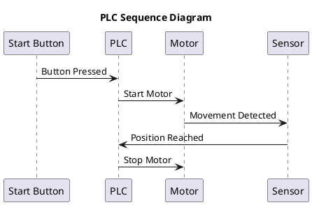
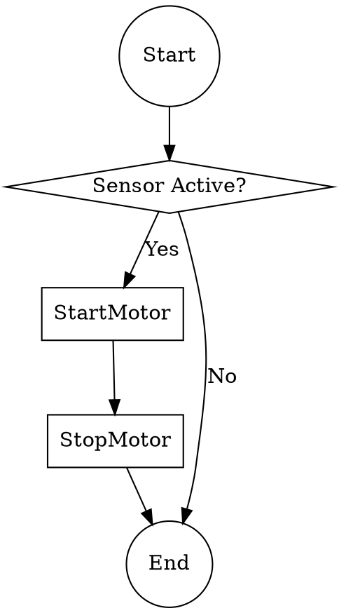
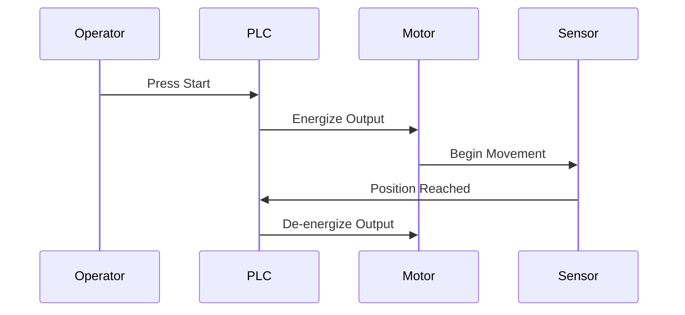

# PLC Sequence & Single-Line Diagram Tools

## Best Tools and Scripts for PLC Documentation

### 1. AutoCAD Electrical
**Type**: Commercial CAD software  
**Best for**: Single-line diagrams, panel layouts, and complete electrical documentation

**Features**:
- Industry-standard electrical symbols library
- Automatic wire numbering and cross-referencing
- PLC I/O integration and reports
- Bill of materials generation

**Script/Automation**: AutoLISP and VBA for custom automation

### 2. EPLAN Electric P8
**Type**: Commercial electrical engineering platform  
**Best for**: Professional single-line and multi-line diagrams

**Features**:
- Comprehensive PLC libraries (Siemens, Allen-Bradley, etc.)
- Automated project generation
- Integrated data management
- API for custom scripting (C#, VB.NET)

### 3. draw.io (diagrams.net)
**Type**: Free, open-source diagramming tool  
**Best for**: Quick sequence diagrams and simple single-line diagrams

**Features**:
- Web-based and desktop versions
- Electrical and PLC symbol libraries available
- Export to PNG, SVG, PDF
- Version control friendly (XML format)

**Script**: JavaScript API for automation

### 4. PlantUML
**Type**: Open-source text-to-diagram tool  
**Best for**: Sequence diagrams and state machines

**Example Script**:


### 5. Python + Schemdraw
**Type**: Python library for circuit diagrams  
**Best for**: Programmatic generation of electrical diagrams

**Example Script**:
```python
import schemdraw
import schemdraw.elements as elm

with schemdraw.Drawing() as d:
    d += elm.SourceV().label('24VDC')
    d += elm.Line().right(1)
    d += elm.Switch().label('Input 1')
    d += elm.Line().right(1)
    d += elm.Resistor().label('PLC Input')
    d += elm.Ground()
    d.save('plc_input.png')
```

### 6. QElectroTech
**Type**: Free, open-source electrical diagram software  
**Best for**: Single-line diagrams and electrical schematics

**Features**:
- Cross-platform (Windows, Linux, macOS)
- Built-in PLC symbol collections
- Automatic conductor numbering
- Export to DXF, SVG, PDF

### 7. Graphviz + DOT Language
**Type**: Graph visualization tool  
**Best for**: PLC logic flow and sequence diagrams

**Example Script**:


### 8. Mermaid.js
**Type**: JavaScript-based diagramming tool  
**Best for**: Sequence diagrams in documentation (Markdown-friendly)

**Example Script**:


## Recommendations by Use Case

| Use Case | Recommended Tool | Reason |
|----------|------------------|--------|
| Professional documentation | EPLAN or AutoCAD Electrical | Industry standard, comprehensive |
| Quick diagrams | draw.io | Free, easy to use |
| Version-controlled diagrams | PlantUML or Mermaid | Text-based, Git-friendly |
| Programmatic generation | Python + Schemdraw | Full automation capability |
| Open-source alternative | QElectroTech | Free, feature-rich |
| Sequence diagrams | PlantUML or Mermaid | Specialized for sequences |

## Scripting Tips

1. **Automate repetitive tasks**: Use Python or AutoLISP to generate multiple similar diagrams
2. **Version control**: Prefer text-based formats (PlantUML, DOT, Mermaid) for Git integration
3. **Template libraries**: Create reusable symbol libraries for your specific PLC hardware
4. **Export automation**: Script batch exports to PDF for documentation packages
5. **Data-driven diagrams**: Generate diagrams from PLC I/O lists or CSV files
