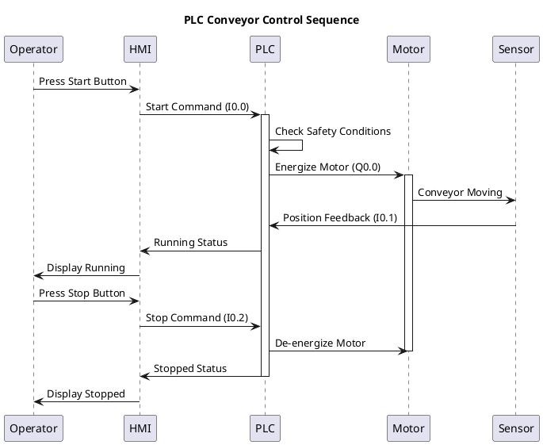
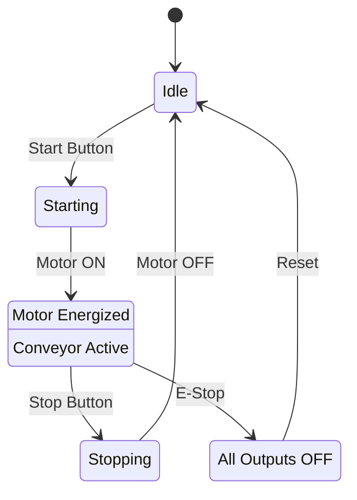
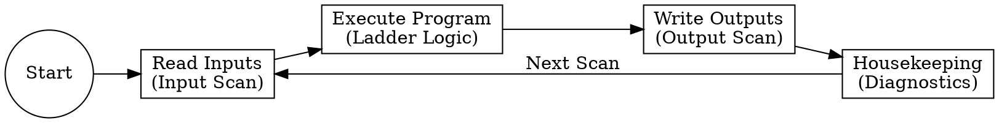

# Best Scripts and Tools for PLC Sequence and Single-Line Diagrams

## Overview

Creating clear, professional sequence diagrams and single-line diagrams (SLDs) is essential for PLC programming, electrical design, and industrial automation documentation. This guide covers the best tools and scripts for generating these diagrams efficiently.

## Top Tools for PLC Sequence Diagrams

### 1. PlantUML (Open Source)

**Best for**: Text-based diagram generation, version control integration

**Installation**:
```bash
# Using package manager
sudo apt-get install plantuml  # Linux
brew install plantuml          # macOS

# Or download JAR from https://plantuml.com/download
```

**Example PLC Sequence Diagram**:


**Advantages**:
- Plain text format (easy to version control with Git)
- Integrates with CI/CD pipelines
- Supports multiple diagram types
- Free and open source

**Generate diagram**:
```bash
plantuml sequence.puml
# Outputs sequence.png
```

### 2. Mermaid (JavaScript-based)

**Best for**: Web-based documentation, Markdown integration

**Installation**:
```bash
npm install -g @mermaid-js/mermaid-cli
```

**Example PLC State Diagram**:


**Generate diagram**:
```bash
mmdc -i diagram.mmd -o diagram.png
```

**Advantages**:
- Renders directly in GitHub, GitLab, and many documentation platforms
- No external dependencies for web viewing
- Simple syntax
- Active development community

### 3. draw.io / diagrams.net (Free Desktop/Web)

**Best for**: Visual editing, complex diagrams

**Features**:
- Drag-and-drop interface
- Extensive PLC symbol libraries
- Export to PNG, SVG, PDF
- Desktop and web versions
- Integration with Google Drive, OneDrive

**PLC-specific libraries**:
- Electrical symbols
- Automation components
- Network diagrams
- Custom shape creation

**Download**: https://www.diagrams.net/

### 4. Graphviz (Open Source)

**Best for**: Automated diagram generation from data

**Installation**:
```bash
sudo apt-get install graphviz  # Linux
brew install graphviz          # macOS
```

**Example PLC Logic Flow**:


**Generate**:
```bash
dot -Tpng plc_logic.dot -o plc_logic.png
```

## Top Tools for Single-Line Diagrams (SLDs)

### 1. QElectroTech (Open Source)

**Best for**: Professional electrical single-line diagrams

**Features**:
- Extensive electrical symbol library (IEC, NEMA, IEEE standards)
- Automatic wire numbering
- Bill of materials generation
- Cross-reference tables
- Multi-page projects

**Installation**:
```bash
sudo apt-get install qelectrotech  # Linux
brew install --cask qelectrotech    # macOS
# Windows: Download from https://qelectrotech.org/
```

**Advantages**:
- Free and open source
- Professional-quality output
- Active community with symbol collections
- Supports multiple languages

### 2. AutoCAD Electrical (Commercial)

**Best for**: Enterprise-level electrical design

**Features**:
- Industry-standard tool
- Comprehensive symbol libraries (65,000+ symbols)
- Automatic report generation
- PLC I/O integration
- 3D panel layout

**Price**: Subscription-based (~$2,000/year)

**Use case**: Large industrial projects requiring full CAD integration

### 3. EPLAN Electric P8 (Commercial)

**Best for**: Automation and control panel design

**Features**:
- Integrated PLC programming interface
- Automatic single-line diagram generation from schematics
- Data-driven engineering
- Macro libraries for common circuits

**Price**: Enterprise pricing (contact vendor)

**Use case**: Professional automation engineering firms

### 4. Python with Schemdraw (Open Source)

**Best for**: Programmatic diagram generation

**Installation**:
```bash
pip install schemdraw
```

**Example Single-Line Diagram Script**:
```python
import schemdraw
import schemdraw.elements as elm

with schemdraw.Drawing() as d:
    d.config(unit=2)
    
    # Power source
    d += (source := elm.SourceV().label('480V\n3-Phase'))
    
    # Main breaker
    d += elm.Line().right(1)
    d += (breaker := elm.Switch().label('Main\nBreaker\n100A'))
    
    # Transformer
    d += elm.Line().right(1)
    d += (xfmr := elm.Transformer().label('480V/120V\n10kVA'))
    
    # PLC power supply
    d += elm.Line().right(1)
    d += (ps := elm.Box(w=2, h=1.5).label('PLC\nPower Supply\n24V DC'))
    
    # PLC
    d += elm.Line().right(1)
    d += elm.Box(w=2, h=2).label('PLC\nCPU\n16 I/O')
    
    # Ground
    d += elm.Line().down(1).at(source.start)
    d += elm.Ground()
    
    d.save('plc_sld.png')
```

**Advantages**:
- Fully scriptable and automatable
- Version control friendly
- Can generate diagrams from PLC configuration files
- Integrates with Python automation workflows

### 5. Inkscape with Electrical Symbols (Open Source)

**Best for**: Custom single-line diagrams with artistic control

**Installation**:
```bash
sudo apt-get install inkscape  # Linux
brew install --cask inkscape   # macOS
# Windows: Download from https://inkscape.org/
```

**Symbol Libraries**:
- Download electrical symbol libraries from:
  - https://github.com/upb-lea/Inkscape_electric_Symbols
  - https://electrical-symbols.com/

**Advantages**:
- Professional vector graphics
- Complete design freedom
- Export to any format (SVG, PDF, PNG)
- Free and cross-platform

## Scripting Solutions for Automation

### Python Script for Auto-Generating Sequence Diagrams from PLC Tags

```python
#!/usr/bin/env python3
"""
Generate PlantUML sequence diagram from PLC tag list
"""

import csv
import sys

def generate_sequence_diagram(tag_file, output_file):
    """
    Read PLC tags from CSV and generate sequence diagram
    CSV format: TagName, Type, Description, Address
    """
    
    with open(tag_file, 'r') as f:
        reader = csv.DictReader(f)
        tags = list(reader)
    
    # Start PlantUML diagram
    diagram = ['@startuml', 'title PLC I/O Sequence', '']
    
    # Define participants
    diagram.append('participant "Operator" as OP')
    diagram.append('participant "HMI" as HMI')
    diagram.append('participant "PLC" as PLC')
    
    # Add device participants from tags
    devices = set()
    for tag in tags:
        if tag['Type'] in ['Output', 'Input']:
            device = tag['Description'].split()[0]
            devices.add(device)
    
    for device in sorted(devices):
        diagram.append(f'participant "{device}" as {device.replace(" ", "_")}')
    
    diagram.append('')
    
    # Generate sequence based on tag order
    for tag in tags:
        if tag['Type'] == 'Input':
            device = tag['Description'].split()[0].replace(" ", "_")
            diagram.append(f'{device} -> PLC: {tag["TagName"]} ({tag["Address"]})')
        elif tag['Type'] == 'Output':
            device = tag['Description'].split()[0].replace(" ", "_")
            diagram.append(f'PLC -> {device}: {tag["TagName"]} ({tag["Address"]})')
    
    diagram.append('')
    diagram.append('@enduml')
    
    # Write output
    with open(output_file, 'w') as f:
        f.write('\n'.join(diagram))
    
    print(f"Generated {output_file}")
    print(f"Run: plantuml {output_file}")

if __name__ == '__main__':
    if len(sys.argv) != 3:
        print("Usage: python generate_sequence.py tags.csv output.puml")
        sys.exit(1)
    
    generate_sequence_diagram(sys.argv[1], sys.argv[2])
```

**Usage**:
```bash
python generate_sequence.py plc_tags.csv sequence.puml
plantuml sequence.puml
```

### Bash Script for Batch Diagram Generation

```bash
#!/bin/bash
# batch_diagrams.sh - Generate all PLC diagrams from source files

set -e

DIAGRAM_DIR="diagrams"
OUTPUT_DIR="output"

mkdir -p "$OUTPUT_DIR"

echo "Generating PLC diagrams..."

# Generate PlantUML diagrams
for file in "$DIAGRAM_DIR"/*.puml; do
    if [ -f "$file" ]; then
        echo "Processing $file"
        plantuml -o "../$OUTPUT_DIR" "$file"
    fi
done

# Generate Mermaid diagrams
for file in "$DIAGRAM_DIR"/*.mmd; do
    if [ -f "$file" ]; then
        echo "Processing $file"
        basename=$(basename "$file" .mmd)
        mmdc -i "$file" -o "$OUTPUT_DIR/${basename}.png"
    fi
done

# Generate Graphviz diagrams
for file in "$DIAGRAM_DIR"/*.dot; do
    if [ -f "$file" ]; then
        echo "Processing $file"
        basename=$(basename "$file" .dot)
        dot -Tpng "$file" -o "$OUTPUT_DIR/${basename}.png"
    fi
done

echo "All diagrams generated in $OUTPUT_DIR/"
```

## Comparison Matrix

| Tool | Type | Cost | Best For | Learning Curve | Output Quality |
|------|------|------|----------|----------------|----------------|
| PlantUML | Text-based | Free | Version control, automation | Low | Good |
| Mermaid | Text-based | Free | Web docs, Markdown | Low | Good |
| draw.io | Visual | Free | Quick diagrams, presentations | Very Low | Excellent |
| Graphviz | Text-based | Free | Automated generation | Medium | Good |
| QElectroTech | Visual | Free | Electrical SLDs | Medium | Excellent |
| AutoCAD Electrical | Visual | $$$ | Professional electrical design | High | Excellent |
| EPLAN | Visual | $$$$ | Enterprise automation | High | Excellent |
| Schemdraw | Script | Free | Python automation | Medium | Good |
| Inkscape | Visual | Free | Custom graphics | Medium | Excellent |

## Recommended Workflow

### For Small Projects:
1. **Sequence diagrams**: PlantUML or Mermaid (text-based, version controlled)
2. **Single-line diagrams**: QElectroTech or draw.io (free, professional quality)

### For Medium Projects:
1. **Sequence diagrams**: PlantUML with custom scripts for auto-generation
2. **Single-line diagrams**: QElectroTech with symbol libraries
3. **Documentation**: Integrate Mermaid diagrams in Markdown docs

### For Enterprise Projects:
1. **Sequence diagrams**: PlantUML integrated with CI/CD
2. **Single-line diagrams**: AutoCAD Electrical or EPLAN
3. **Automation**: Python scripts to generate diagrams from PLC exports

## Integration with PLC Programming Software

Many PLC programming environments can export tag lists and logic that can be converted to diagrams:

- **Siemens TIA Portal**: Export tag tables to CSV → Python script → PlantUML
- **Rockwell Studio 5000**: Export I/O configuration → Excel → Schemdraw
- **Schneider EcoStruxure**: Export project data → XML parser → Graphviz
- **CODESYS**: Export symbol configuration → JSON → Mermaid

## Conclusion

**Best overall recommendation**:
- **Sequence diagrams**: **PlantUML** for text-based version control and automation
- **Single-line diagrams**: **QElectroTech** for free professional quality, or **AutoCAD Electrical** for enterprise needs

For maximum flexibility, use PlantUML/Mermaid for sequence diagrams (easy to automate and version control) and QElectroTech for single-line diagrams (professional electrical standards compliance). Both are free, cross-platform, and produce publication-quality output.
